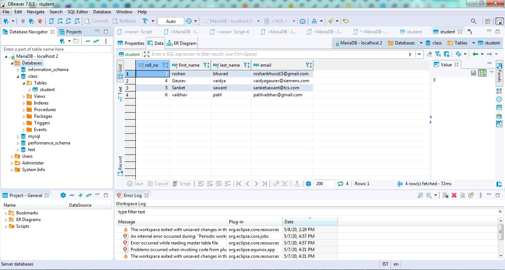
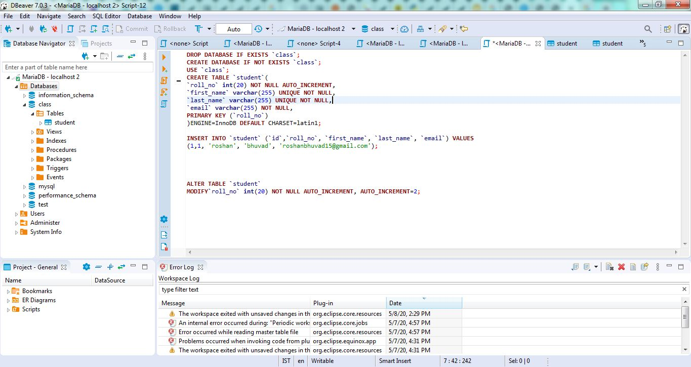
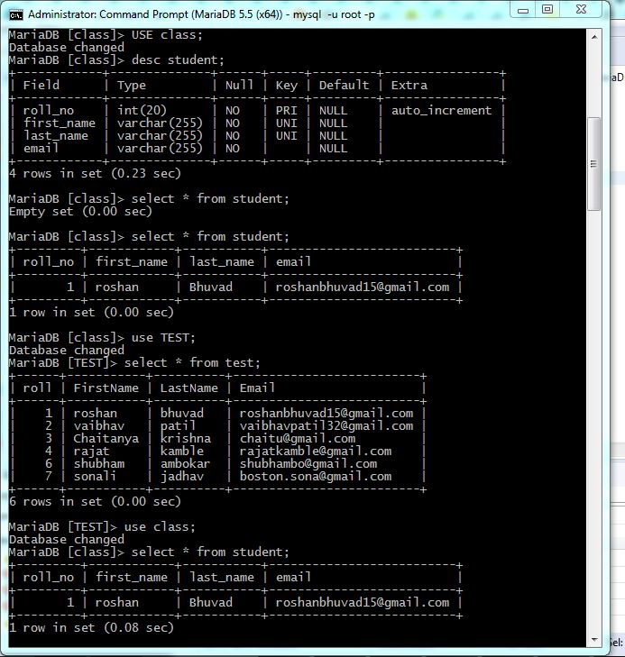

# Flask-Web-Application-with-MariaDB-database
Simple Student database with Flask Application

# MariaDB Database structure in DBeaver 

# MariaDB SQL Query

# CMD for MariaDB 5.5

# Registration form for student details 

# New Entry registered successfully!

# Retrieve registered data from MariaDB database

# Fetching specific rows of data from the database

# Update existing student data from table

# Updating existing data

